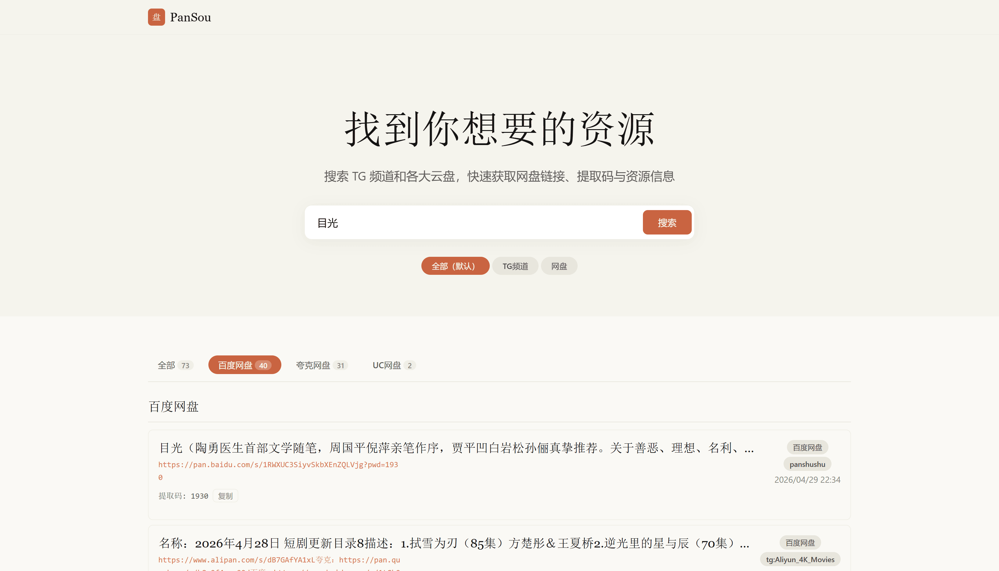

# PanPanXia - 盘盘侠

聚合搜索 Telegram 频道和多个云盘资源站的资源搜索引擎，使用 Rust + Axum 开发

支持链接有效性检测（TODO）、多插件并发搜索、内嵌前端界面。



## API 路由

- `GET/POST /api/search` — 搜索
- `POST /api/check/links` — 批量链接有效性检测
- `GET /api/health` — 健康检查

## 构建

```bash
cargo build --release
```

编译产物位于 `target/release/pansou-rust`。

- Linux 静态链接：`cargo build --release --target x86_64-unknown-linux-musl`（需安装 `musl-tools`）
- ARM64 交叉编译：使用 [`cross`](https://github.com/cross-rs/cross) 工具

推送 `v*` 标签时，GitHub Actions 自动构建多平台二进制文件并发布 Release。

## 运行

```bash
cargo run
```

默认监听 `8888` 端口，配置通过 `config.yaml` 文件管理：

```yaml
host: 0.0.0.0
port: 8888
channels:
  - tgsearchers6
  - sou1xia
log_level: info
log_file: logs/app.log
concurrency: 6
cache_ttl: 300
max_cache_size: 1024

# 后置插件：搜索完成后将结果推送到落库服务，留空则不启用
post_search_endpoint: "http://localhost:9999/api/ingest"
```

## Python 落库服务

```bash
cd python-service
pip install fastapi uvicorn
python main.py
```

默认监听 `0.0.0.0:9999`，接收搜索结果的 API 为 `POST /api/ingest`。

数据表结构：`search_results`（结果条目）

## 说明

- API 路由、请求字段和响应结构与 Go 版本保持兼容。
- 搜索核心：TG 频道抓取（`t.me/s/{channel}?q=...`）与网盘插件搜索并行执行，结果合并去重、优先级排序、`merged_by_type` 聚合。
- 网盘插件：`panshushu`、`sosoyunpan`（`src/plugin/`）。
- 后置插件：搜索完成后触发 `PostSearchPlugin`，可用于将结果推送到外部服务落库（`src/post_search/`）。
- Python 落库服务：`python-service/` 提供接收 API，将搜索结果写入 SQLite（表：`search_results`）。
- 搜索缓存：搜索结果带 TTL 内存缓存，相同查询直接返回缓存结果，`force_refresh=true` 时强制刷新。
- 链接检测：标准化、状态机、TTL 内存缓存，批量检测响应结构。
- 日志：使用 `tracing` 输出到控制台及文件，每次请求自动生成 `request_id` 贯穿上下文。

## 测试

```bash
cargo test
```

覆盖 `model`、`handlers`、`service::search`、`service::check` 四个模块，共 76 个测试用例。
